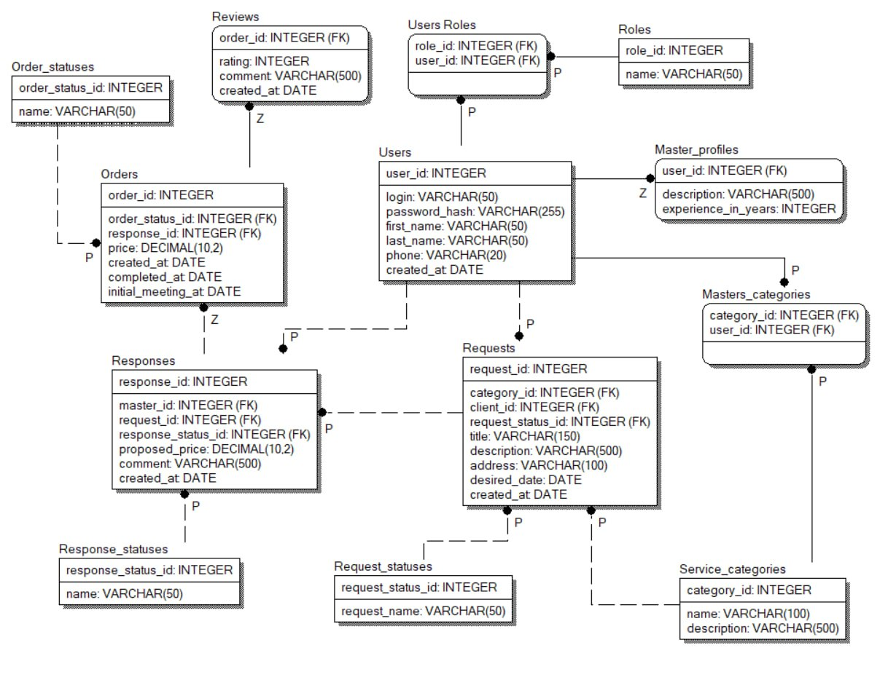
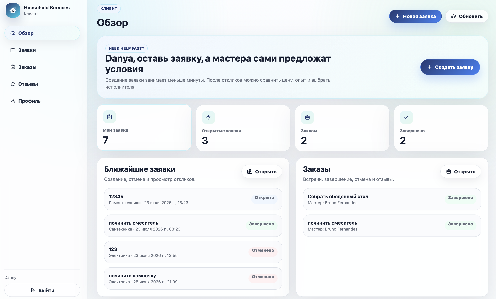
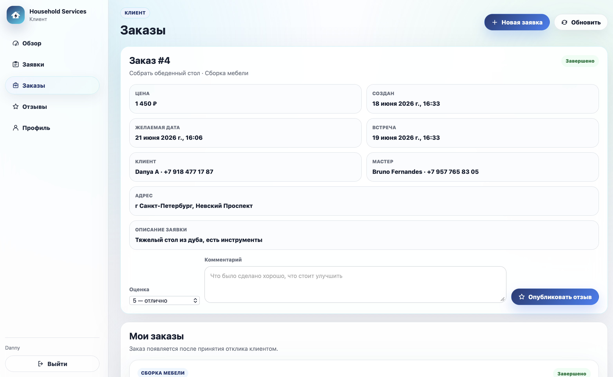
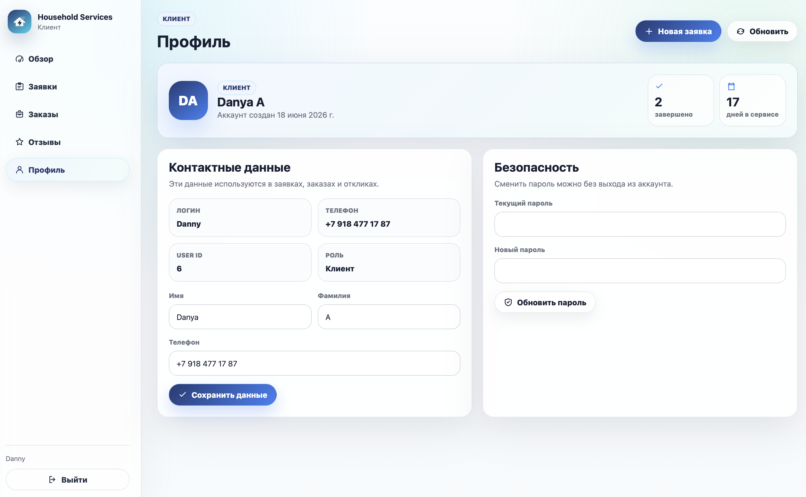
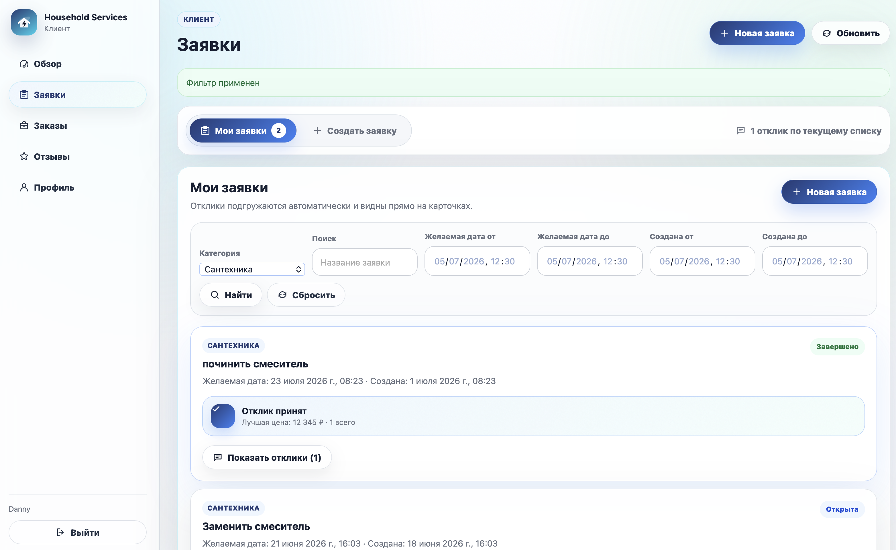
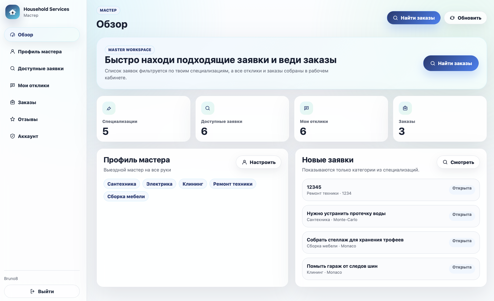
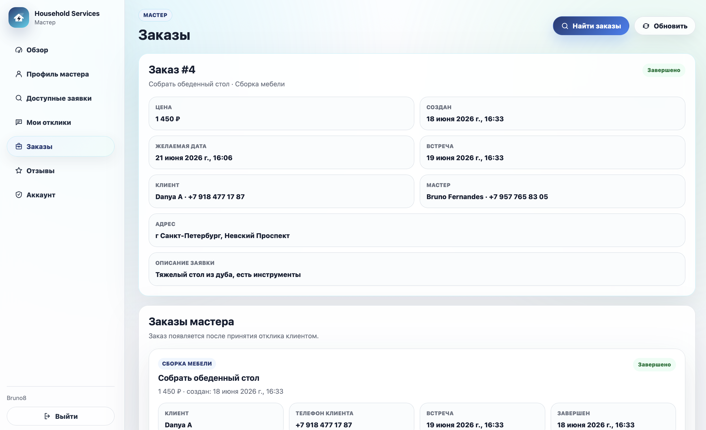
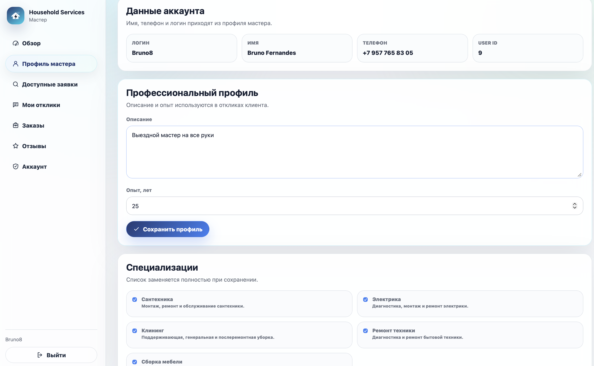
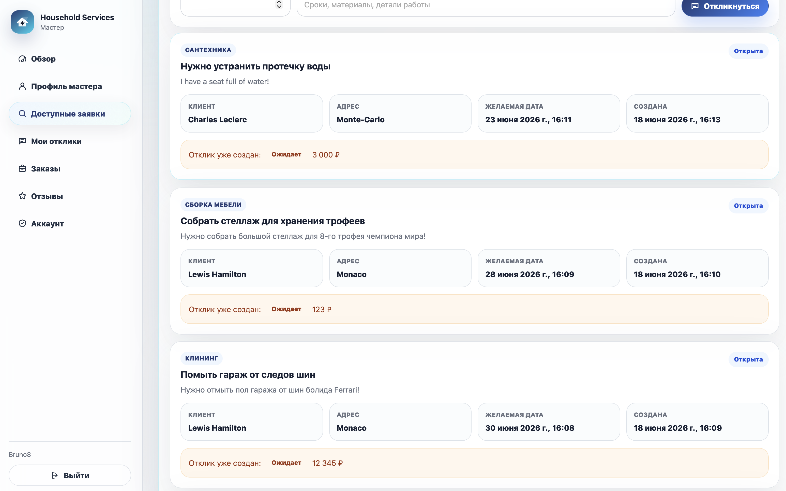
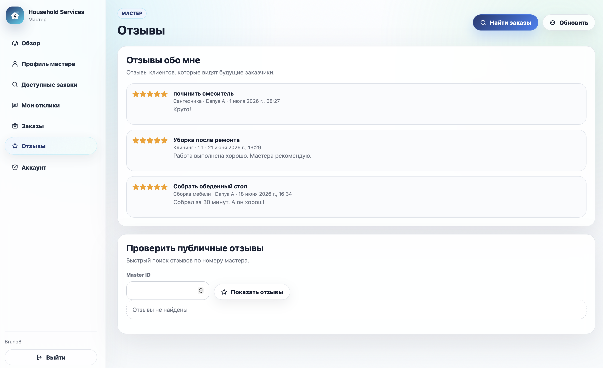

# Household Services
Платформа для взаимодействия клиентов и мастеров в сфере бытовых услуг

## О проекте

**Household Services** — RESTful веб-приложение, соединяющее заказскиков бытовых услуг и мастеров соответствующих специализаций. Клиенты могут создавать заявки, а мастера — вести профессиональные профили, указывать специализации и откликаться на доступные заявки

После принятия отклика на его основе создаётся заказ. После завершения заказа клиент может оставить отзыв о выполненной работе

### Деплой на Render
*Для проекта используется бесплатный хостинг с ограниченным функционалом. Для запуска всех сервисов проекта необходимо запустить оба сервиса, перейдя по ссылкам и подождать не более минуты*
### 1. [Backend launch](https://household-services-q5k0.onrender.com)
### 2. [Household services](https://household-services-frontend.onrender.com)
*UI создан при помощи ИИ агента и нужен исключительно для демонстрации функционала серверной части приложения в более человекочитаемом виде.*

### 3. [Swagger](https://household-services-q5k0.onrender.com/swagger/index.html) 
*Для Swagger так же нужно ожидать запуска*

## Технологический стек

- **Язык программирования:** `C#`
- **Версия платформы:** `.NET 10.0`
- **Backend:** `ASP.NET Core Web API`
- **Frontend:** `HTML, CSS, JavaScript`
- **ORM:** `Entity Framework Core`
- **СУБД:** `PostgreSQL`

## Схема БД (IDEF1X)

## Документация

**[Техническое задание (pdf)](docs/ProjectDoc.pdf)**  
**Файл технического задания включает в себя:**
  - Описание предметной области;
  - проектирование базы данных;
  - функциональные требования; 
  - usecases;
  - проектирование API и DTO; 
  - коды ответов.
  
 ### Основные возможности
- JWT-аутентификация и авторизация
- Роли: клиент и мастер
- PostgreSQL triggers и views
- Создание и управление заявками
- Профили и специализации мастеров
- Отклики на заявки
- Автоматическое создание заказа после принятия отклика
- Отзывы после завершения заказа

## Скриншоты интерфейса

### Главная страница клиента

### Заказы клиента

### Профиль клиента

### Создание заявки клиентом

### Главная страница мастера

### Заказы мастера

### Профиль мастера

### Отклики мастера

### Отзывы о мастере

## Состав команды

- **Авдиенко Данила** @avd1enko
- **Говоров Павел** @Seztor